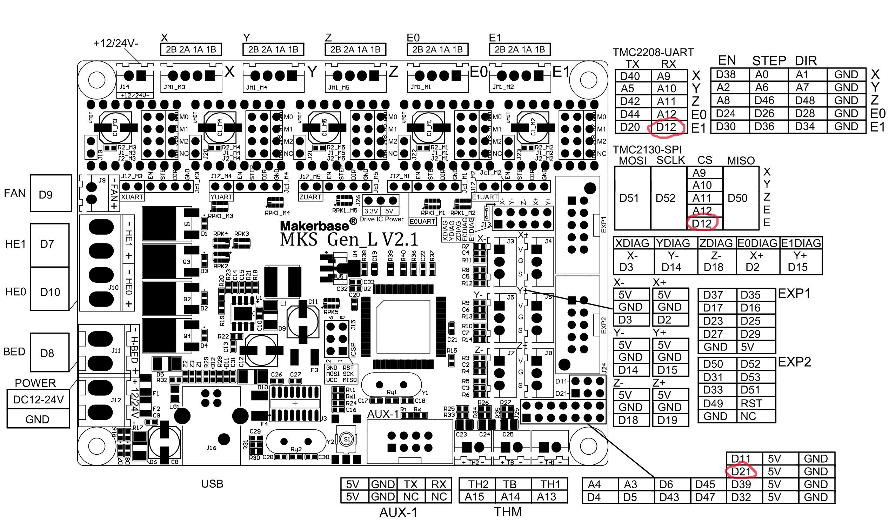

# Creator Pro Redux:

This README page documents the rebuild/repair of a Flashforge Creator Pro with a bad motherboard

- Replacement motherboard is a [Makerbase MKS GEN L V2.1](https://github.com/makerbase-mks/MKS-GEN_L/wiki/MKS_GEN_L_V2)
- Replaced 24v power supply with a new 12v power supply
- Replaced hot end thermocouple with a new heater block, heater and thermistor
- Replaced stock rectangular heated bed with a generic square magnetic heated bed
  - Fabricated a new aluminum base for the bed including bed adjustors and springs
- All 3 24v fans were replaced with 12v fans
  - motherboard fan is hardwired into the power supply so its on all the time
  - parts fan is controlled with the G-code of the print file
  - extruder fan comes on when the nozzle exceeds 30C
- Replacement LCD display is a [Makebase MKS MINI12864](https://www.amazon.com/your-orders/orders?_encoding=UTF8&startIndex=20&ref_=ppx_yo2ov_dt_b_pagination_4_3)
- 24V LED RGB lights were replaced with [12V LED RGB lights from TH3D](https://www.th3dstudio.com/product/ezneo220-rgb-printer-lighting-strip/)

## Building Firmware

Use this repository to build the firmware for this printer. Make sure you're in the creator.pro.redux.current branch before you compile and deploy the code.

### Slicer Settings

- Build plate shape: Rectangular
- Origin at center
- Heated bed
- G-code flavor: Marlin 2
- Number of Extruders: 1
- X (Bed Width) 211
- Y (Bed Depth) 161
- Z (Bed Height) 150
- Nozzle size: 0.4
- Compatible material diameter: 1.75
- Nozzle offset X: 70
- Nozzle offset Y: 70
- Cooling Fan Number: 1

## PID Process Hot End

Recv: #define DEFAULT_Kp 31.68
Recv: #define DEFAULT_Ki 2.42
Recv: #define DEFAULT_Kd 103.81

```M106 S255
m303 E0 S220 C7
M301 p31.68 i2.42 d103.81
M500
```
## Alternate MPC Process Hot End Only (not good results so far)

```M306 T```

## PID Process Bed

```#define DEFAULT_bedKp 134.53
#define DEFAULT_bedKi 15.49
#define DEFAULT_bedKd 778.81

M303 E-1 S60 C5
M304 p134.53 i15.49 d778.81
M500
M503
```
## Finished Pics



